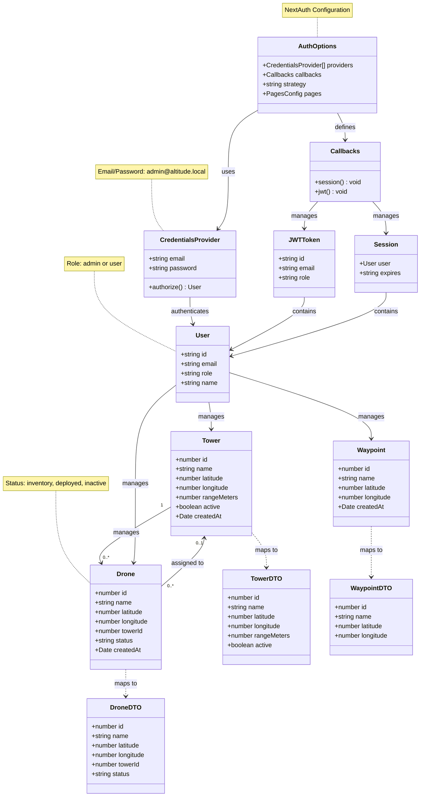

# Altitude Management - Class Diagram

## Entity Descriptions

### Authentication System (NextAuth)

**AuthOptions**
- Configuration for NextAuth authentication
- Defines providers, callbacks, and session strategy
- JWT-based session strategy

**CredentialsProvider**
- Implements email/password authentication
- Static admin credentials: `admin@altitude.local` / `admin123`
- Returns User object on successful authorization

**Callbacks**
- `session()`: Adds role information to session
- `jwt()`: Adds role information to JWT token

**JWTToken**
- Contains user id, email, and role
- Used for maintaining session state

**Session**
- Contains authenticated user information
- Expiration date for session validity

### Core Entities

**User**
- Authentication entity via NextAuth
- Roles: admin or user
- Admin users have full CRUD access

**Tower**
- Communication towers that define drone broadcast ranges
- Located at specific coordinates (latitude/longitude)
- Has a range in meters that determines coverage area
- Can be active or inactive

**Drone**
- Flying vehicles that can be in inventory or deployed
- When deployed, must be assigned to a tower
- Status can be: inventory, deployed, or inactive
- Location is optional (null when in inventory)

**Waypoint**
- Navigation destination points on the map
- Static locations with coordinates
- Independent of towers and drones

### Data Transfer Objects (DTOs)

DTOs are used for client-side serialization, converting database decimal types to numbers and handling null/undefined values for React components.

## Relationships

1. **Authentication Flow**:
   - CredentialsProvider authenticates users and returns User
   - Callbacks manage JWT tokens and sessions with role information
   
2. **Drone → Tower**: Many-to-one (optional)
   - A drone can be assigned to zero or one tower
   - A tower can manage multiple drones
   - Foreign key with SET NULL on delete

3. **User manages all entities**: One-to-many
   - Admin users can create, read, update, and delete all entities
